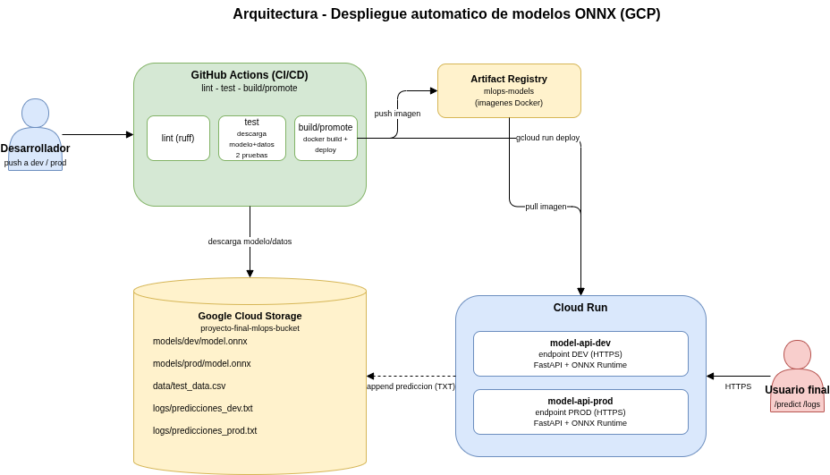
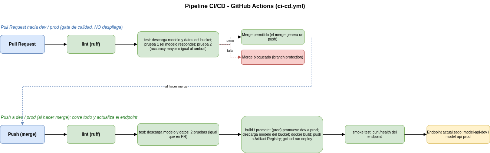

# Despliegue automático de modelos ONNX (MLOps)

Sistema de **CI/CD para el despliegue automático de modelos de Machine Learning** en formato
ONNX. Partiendo del supuesto de que ya existe un modelo en producción, este repositorio permite
que **cada nuevo modelo se pruebe y se despliegue de forma automática** para que los usuarios
finales lo consuman a través de una API.

El caso de uso de ejemplo es un **clasificador de cáncer de mama** (dataset _Breast Cancer_ de
scikit-learn): dado un vector de 30 mediciones, predice si un tumor es **benigno** o **maligno**.

---

## Arquitectura



> Diagramas editables en `docs/arquitectura.drawio` y `docs/pipeline.drawio` (extensión _Draw.io
> Integration_ de VSCode). Si alguna imagen no se ve, expórtala a PNG desde VSCode (ver
> `indicaciones-william.md`, Apéndice A §6.bis). A continuación, una vista esquemática de respaldo:

```
   PR ──► (test gate)         merge ──► push
                                          │
              ▼                           ▼
   ┌─────────────────────────────────────────────┐
   │            GitHub Actions (CI/CD)            │
   │                                             │
   │  PR:   [lint] ──► [test]                     │
   │  push: [lint] ──► [test] ──► [build/promote] ──► Cloud Run
   │     │              │                        │
   │     │ descarga     │ descarga modelo,       │
   │     │ modelo+datos │ construye imagen,      │
   │     ▼              ▼ despliega endpoint     │
   └─────┼──────────────┼────────────────────────┘
         │              │
         ▼              ▼
   ┌──────────────────────────────┐      ┌──────────────────────────┐
   │       Google Cloud Storage    │      │        Cloud Run          │
   │  models/dev/model.onnx        │      │  model-api-dev   (dev)    │
   │  models/prod/model.onnx       │◄─────┤  model-api-prod  (prod)   │
   │  data/test_data.csv           │ logs │  cada /predict agrega     │
   │  logs/predicciones_dev.txt    │◄─────┤  una linea al TXT         │
   │  logs/predicciones_prod.txt   │      └──────────────────────────┘
   └──────────────────────────────┘
```

- **Nube:** Google Cloud Platform (Cloud Run + Cloud Storage + Artifact Registry).
- **App:** FastAPI + ONNX Runtime, empaquetada en un contenedor Docker.
- **Dos entornos = dos endpoints:** la rama `dev` despliega el servicio `model-api-dev` y la rama
  `prod` despliega `model-api-prod`. Cada uno tiene su propia URL HTTPS estable.

---

## Flujo de trabajo con Pull Requests (branch protection)

Las ramas `dev` y `prod` están **protegidas**: no se permite `push` directo. Todo cambio entra por
**Pull Request**, y para poder hacer _merge_ deben pasar los checks **`lint`** y **`test`** (regla de
_required status checks_). Esto garantiza que **ningún modelo o código llegue a un entorno sin pasar
las pruebas**.

- **Al abrir/actualizar un PR** hacia `dev` o `prod` → se ejecuta **solo la etapa `test`** (gate de
  calidad). No se despliega nada.
- **Al hacer _merge_** (que produce un `push` a la rama) → se ejecuta **`test` + `build/promote`** y
  se actualiza el endpoint del entorno.

> La configuración exacta de las _branch protection rules_ está documentada en `indicaciones-william.md`.

---

## El modelo NO vive en el repositorio

El archivo `.onnx` **nunca** se versiona (está en `.gitignore`). El repositorio solo guarda una
**referencia** al modelo mediante la variable `MODEL_GCS_URI` (configurada por entorno). El modelo
se descarga del bucket de GCS durante el pipeline:

- En la etapa **test** para correr las pruebas.
- En la etapa **build/promote** para hornearlo dentro de la imagen Docker.

---

## Pipeline de CI/CD (`.github/workflows/ci-cd.yml`)



Se dispara con `pull_request` y con `push` a `dev`/`prod`. Mediante GitHub Environments selecciona
las variables/secrets del entorno correspondiente (en PR se toma de la rama destino, `base_ref`).

### Etapa `lint` (corre en PR y en push)

Valida estilo y errores estáticos con **ruff** (`ruff check` + `ruff format --check`) sobre `app/`,
`tests/` y `scripts/`. Es prerrequisito de `test` (`needs: lint`): si falla, no se gasta tiempo en
descargar artefactos ni desplegar.

### Etapa `test` (corre en PR y en push)

1. Autentica en GCP.
2. Descarga `model.onnx` y `test_data.csv` desde el bucket (`scripts/download_artifacts.py`).
3. Corre las pruebas unitarias con `pytest`:
   - **`test_model_response`**: el modelo responde con una salida válida ante una entrada definida.
   - **`test_model_metric`**: el _accuracy_ sobre los datos de prueba **no cae por debajo del
     umbral** (`0.90` por defecto). Si cae, el pipeline falla y **no se permite el merge ni el deploy**.

### Etapa `build/promote` (corre solo en push, tras el merge)

1. (Solo `prod`) **Promueve** el modelo validado: copia `models/dev/model.onnx` → `models/prod/model.onnx`.
2. Descarga el modelo del bucket (según `MODEL_GCS_URI` del entorno).
3. Construye la imagen Docker (con el modelo horneado) y la publica en Artifact Registry.
4. **Despliega en Cloud Run**, actualizando el endpoint del entorno.
5. **Smoke test:** llama a `/health` del endpoint recién desplegado (con reintentos) para confirmar
   que quedó vivo; si no responde, el job falla.

---

## La aplicación (FastAPI)

| Endpoint        | Descripción                                                                                                                                     |
| --------------- | ----------------------------------------------------------------------------------------------------------------------------------------------- |
| `GET /health`   | Healthcheck (usado por Cloud Run y smoke tests). Devuelve `env` y `model_version` (la versión del modelo desplegado, visible también en la UI). |
| `GET /`         | UI HTML sencilla con ejemplos precargados (benigno/maligno) para la demo.                                                                       |
| `GET /examples` | Devuelve los ejemplos y nombres de features (JSON).                                                                                             |
| `POST /predict` | Recibe `{"features": [30 valores]}`, predice y **registra la predicción**.                                                                      |
| `GET /logs`     | Devuelve las últimas predicciones registradas en el TXT del entorno (monitoreo).                                                                |
| `GET /docs`     | Documentación interactiva automática (Swagger).                                                                                                 |

### Registro de predicciones (monitoreo)

Cada llamada a `/predict` agrega una línea al archivo TXT del entorno en el bucket
(`logs/predicciones_dev.txt` o `logs/predicciones_prod.txt`), con timestamp, entrada y predicción.
Como GCS no soporta _append_ nativo, se usa **read-modify-write** (suficiente para el volumen de la
demo; ver _Limitaciones_). El endpoint **`GET /logs`** (y el botón _"Ver predicciones recientes"_ de
la UI) leen ese TXT y muestran las últimas predicciones, útil para demostrar el monitoreo en vivo.

Ejemplo de petición:

```bash
curl -X POST "$URL/predict" \
  -H "Content-Type: application/json" \
  -d '{"features": [13.54,14.36,87.46,566.3,0.09779,0.08129,0.06664,0.04781,0.1885,0.05766,0.2699,0.7886,2.058,23.56,0.008462,0.0146,0.02387,0.01315,0.0198,0.0023,15.11,19.26,99.7,711.2,0.144,0.1773,0.239,0.1288,0.2977,0.07259]}'
```

> 💡 La misma petición se puede hacer desde la **UI** (`/`), desde **Swagger** (`/docs` → _Try it
> out_) o desde **Postman** (importando `/openapi.json`). Todas registran la
> predicción en el TXT.

---

## Configuración (variables de entorno)

El comportamiento del servicio se controla por variables de entorno que el pipeline inyecta en el
`gcloud run deploy`:

| Variable        | Rol                                                                                                                                                                                        |
| --------------- | ------------------------------------------------------------------------------------------------------------------------------------------------------------------------------------------ |
| `ENV`           | Entorno lógico (`dev`/`prod`/`local`); etiqueta las respuestas y el archivo de logs.                                                                                                       |
| `MODEL_VERSION` | Versión del modelo desplegado, visible en `/health` y en la UI. La fija `vars.MODEL_VERSION` o, si está vacía, el SHA corto del commit (así cada despliegue muestra una versión distinta). |
| `GCS_BUCKET`    | Bucket de GCS donde se registran las predicciones.                                                                                                                                         |
| `LOG_FILE`      | Ruta del TXT del entorno (`logs/predicciones_dev.txt` / `logs/predicciones_prod.txt`).                                                                                                     |
| `MODEL_PATH`    | Ruta local del modelo horneado en la imagen (por defecto `model.onnx`).                                                                                                                    |

En CI se usan además `MODEL_GCS_URI` (URI del modelo a descargar del bucket) y `METRIC_THRESHOLD`
(umbral de _accuracy_ exigido por las pruebas, `0.90` por defecto).

---

## Estructura del repositorio

```
.
├── .github/workflows/ci-cd.yml    # pipeline CI/CD (lint+test en PR; +build/promote+smoke en push)
├── app/                           # aplicación FastAPI + inferencia ONNX
│   ├── main.py                    # endpoints (/, /health, /examples, /predict, /logs)
│   ├── model.py                   # carga e inferencia del modelo ONNX
│   ├── gcs_logger.py              # registro y lectura de predicciones en GCS (read-modify-write)
│   └── examples.py                # ejemplos precargados para la UI/demo
├── tests/                         # pruebas unitarias (corren en CI)
│   ├── conftest.py
│   ├── test_model_response.py     # PRUEBA 1: el modelo responde
│   └── test_model_metric.py       # PRUEBA 2: umbral de métrica
├── scripts/
│   ├── train_export_onnx.py       # entrena + exporta a ONNX + genera datos de prueba
│   └── download_artifacts.py      # descarga modelo/datos desde GCS (en CI)
├── docs/                          # diagramas draw.io (arquitectura, pipeline) + doc del pipeline
│   ├── arquitectura.drawio
│   ├── pipeline.drawio
│   └── pipeline_mlops.md
├── Dockerfile                     # imagen del servicio (hornea el modelo descargado en CI)
├── ruff.toml                      # configuración del linter/formateador (etapa lint)
├── requirements.txt               # dependencias de runtime
├── requirements-dev.txt           # dependencias de CI/local (lint + test + entrenamiento)
├── .gitignore                     # excluye *.onnx, *.csv y credenciales
└── README.md
```

## Ramas

Este repositorio usa un modelo de **dos ramas** (no se usa `main`):

- **`dev`** _(rama por defecto / integración)_: entorno de desarrollo. Protegida (PR + checks `lint`/`test`).
  Al hacer merge despliega a `model-api-dev`.
- **`prod`**: entorno de producción. Protegida (PR + checks `lint`/`test`). Al hacer merge promueve el modelo
  validado y despliega a `model-api-prod`.

El trabajo entra por una rama `feature/*` → PR → `dev` → PR → `prod`.

---

## Cómo desplegar un modelo nuevo (flujo MLOps)

1. Entrena/obtén el nuevo modelo (p. ej. `python scripts/train_export_onnx.py --variant v2`) y súbelo
   a `gs://<bucket>/models/dev/model.onnx`.
2. Crea una rama de trabajo y abre un **Pull Request hacia `dev`** → se ejecuta `test`. Si pasa,
   haz _merge_; el `push` resultante despliega en el endpoint `dev`.
3. Valida el endpoint `dev`. Si todo está bien, abre un **Pull Request de `dev` hacia `prod`** →
   se ejecuta `test`; al hacer _merge_, el pipeline **promueve** el modelo (dev→prod) y despliega
   en el endpoint `prod`.

---

## Ejecución local (opcional)

```bash
pip install -r requirements-dev.txt
python scripts/train_export_onnx.py      # genera model.onnx y test_data.csv
pytest -v                                # corre las pruebas
docker build -t modelo-onnx .
docker run -p 8080:8080 -e ENV=local modelo-onnx
# abrir http://localhost:8080
```

---

## Limitaciones conocidas

- El registro de predicciones (read-modify-write a GCS) **no es atómico** bajo alta concurrencia;
  es suficiente para la demo. Para producción real se usaría una cola/log estructurado o BigQuery.
- Los endpoints se despliegan con `--allow-unauthenticated` para facilitar la demo. En un entorno
  real se restringiría el acceso (IAM / API Gateway).
