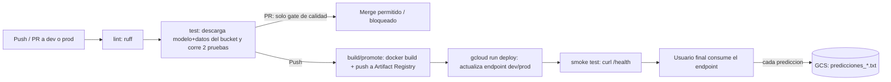

# Pipeline MLOps — Despliegue automático de modelos ONNX

Este documento describe el sistema de CI/CD para el despliegue automático de modelos de Machine
Learning en formato ONNX. Los diagramas editables están en `docs/arquitectura.drawio` y
`docs/pipeline.drawio` (ábrelos con la extensión **Draw.io Integration** de VSCode).

## 1. Contexto del problema

Partimos del supuesto de que **ya existe un modelo en producción**. El objetivo es un sistema que
permita que **nuevos modelos se prueben y desplieguen de forma automática**, sin intervención
manual, para que los usuarios finales los consuman a través de un endpoint estable.

El caso de uso de ejemplo es un **clasificador de cáncer de mama** (dataset *Breast Cancer* de
scikit-learn): dado un vector de 30 mediciones, predice si un tumor es **benigno** o **maligno**.

## 2. Diagrama general (flujo lógico)

## 3. Componentes en la nube (GCP)

| Componente | Rol |
|---|---|
| **Cloud Storage** (`proyecto-final-mlops-bucket`) | Aloja el modelo (`models/dev`, `models/prod`), los datos de prueba (`data/`) y los logs de predicciones (`logs/`). El modelo y los datos **no viven en el repo**. |
| **Artifact Registry** (`mlops-models`) | Almacena las imágenes Docker construidas por el pipeline. |
| **Cloud Run** (`model-api-dev`, `model-api-prod`) | Ejecuta el contenedor; expone un endpoint HTTPS por entorno. |
| **GitHub Actions** | Orquesta lint → test → build/promote → smoke test. |

## 4. Etapas del pipeline (`.github/workflows/ci-cd.yml`)

1. **lint** — `ruff check` + `ruff format --check` sobre `app/`, `tests/`, `scripts/`.
2. **test** — descarga modelo + datos del bucket y corre dos pruebas obligatorias:
   - el modelo **responde** ante una entrada definida;
   - el **accuracy no cae por debajo del umbral** (`METRIC_THRESHOLD`, por defecto `0.90`).
3. **build/promote** (solo en `push`) — (en `prod`) promueve `models/dev → models/prod`, descarga
   el modelo, construye la imagen con el modelo horneado, la publica y hace `gcloud run deploy`.
4. **smoke test** — llama a `/health` del endpoint recién desplegado para confirmar que quedó vivo.

## 5. Gobierno del flujo (dev → prod)

Las ramas `dev` y `prod` están protegidas: todo cambio entra por **Pull Request** y requiere que el
check `test` pase. En PR solo corren `lint` + `test` (no se despliega). Al hacer *merge* (push) se
ejecuta además `build/promote`, garantizando que **ningún modelo llegue a un entorno sin validarse**.

## 6. Monitoreo

Cada llamada a `/predict` agrega una línea (timestamp, entrada, predicción) al TXT del entorno en
GCS (`logs/predicciones_dev.txt` o `logs/predicciones_prod.txt`). El endpoint `/logs` permite
visualizar las últimas predicciones registradas, útil para la demostración y futuros análisis.
